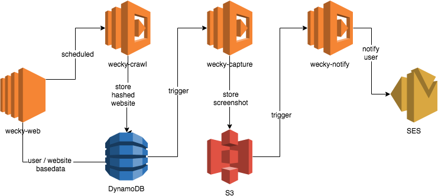

# Wecky - Website Checker
Checks a website for a user and notifies the user by email if it changed.

This is mostly an AWS playground. :-)

## Getting started 
You can configure wecky-web either to use a local dev DynamoDB or the production DB.
When you want to use the local dev DB, set System Property accordingly.
You can either use [localstack](https://github.com/localstack/localstack) or just follow the instructions given [here](https://docs.aws.amazon.com/de_de/amazondynamodb/latest/developerguide/DynamoDBLocal.html).

```
amazon.dynamodb.endpoint=http://localhost:8000
```

When running `wecky-web` against the production AWS environment, you need to set the accessKeyId and secretKey.  
```
aws.accessKeyId=YOURKEYID
```
```
aws.secretKey=YOURKEYID
```
This can be done in Spring Boot style, using a system property for instance: `-Daws.accessKeyId=FOOBAR`.

## Architecture
`wecky-web` itself is a Spring Boot application that uses 
* `spring-data-dynamodb` to read/write from/to DynamoDB and 
* `aws-java-sdk-lambda` to call lambda functions from java.

The overall systems architecture is as follows: 


## Further reading
* [Setting Up DynamoDB Locally](https://docs.aws.amazon.com/amazondynamodb/latest/developerguide/DynamoDBLocal.html)
* [Working with AWS Credentials](https://docs.aws.amazon.com/sdk-for-java/v1/developer-guide/credentials.html)
* [Configuration and Credential Files](https://docs.aws.amazon.com/cli/latest/userguide/cli-config-files.html)
